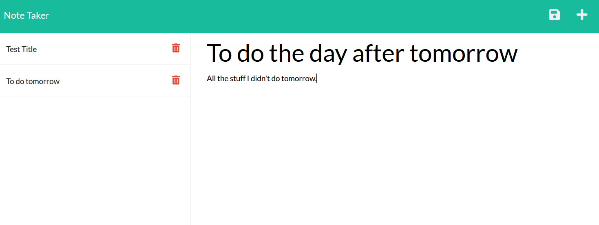

# online_notebook
This program is a server-based notebook.
It allows the user to add and delete text notes with a title, which are stored on a server accessible from anywhere. For now there is no login, anyone with the address is free to add and delete notes.  
This is what the interface looks like: 
  
It is deployed on heroku, to try it out please follow the link below: 
<a href="https://notebook9001.herokuapp.com/notes" target="_blank">Online Notebook</a> <br<>
For any questions, please send me an email at the following link: 
<a href="mailto:nialvo@protonmail.com">Email</a>